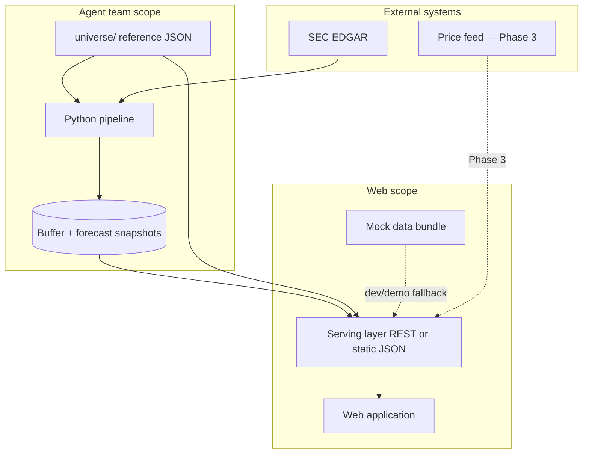
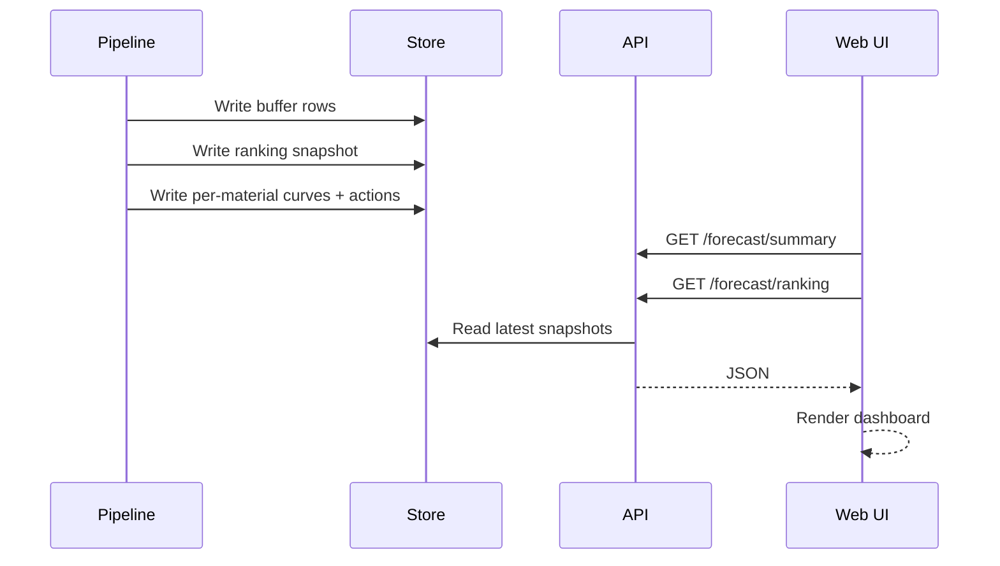
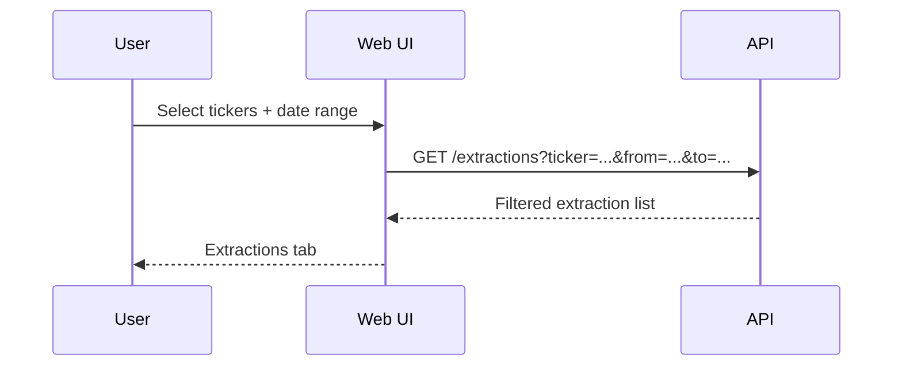

# High-Level Design — Web Interface

| Field | Value |
|-------|-------|
| **Status** | Draft — pre-implementation |
| **Version** | 0.1 |
| **Owner** | Web / frontend |
| **Consumers** | Agent team (pipeline + API), demo audience |
| **Related docs** | [README.md](../README.md), [backend/universe/README.md](../backend/universe/README.md) |

---

## 1. Purpose

This document defines the **high-level design** for the algo-trade web interface: system boundaries, logical architecture, API contract, mock-data strategy, and phased delivery. **No UI implementation** is in scope for this document.

The web app is a **read-only presentation layer** over pipeline outputs. It makes narrative-derived material forecasts legible for a **demo audience** and supports audit drill-down (company → filing → source span).

> Research and education only. The UI must surface the project disclaimer on every screen.

---

## 2. Goals and non-goals

### Goals (v1)

- Present a **forecast dashboard**: ranked materials, signal curves, BUY/SELL timing
- Support **Explorer**: user selects filing tickers + date range → extractions results
- Enable **audit trail**: material → contributing companies → filing → SEC link
- Run fully on **mock JSON** until the agent pipeline API is ready
- Share a **stable JSON contract** with the agent team before either side builds deeply

### Non-goals (v1)

- Running LLM or EDGAR calls from the browser
- Triggering pipeline jobs from the UI (deferred)
- User accounts / authentication
- Live price charts (Explorer Phase 3 — deferred)
- Backtest UI (deferred)

---

## 3. System context



### Ownership

| Layer | Owner | Notes |
|-------|-------|-------|
| `universe/*.json` | Data / agent team | Static reference; UI reads as-is |
| Buffer, rankings, curves, timer | Agent team | Source of truth for forecast data |
| Serving layer (`/api/v1/*`) | **TBD** — agree in team sync | FastAPI wrapper **or** static file server |
| Mock data bundle | Web team | Mirrors API contract; used until pipeline live |
| Web application | Web team | React SPA (stack TBD) |

---

## 4. Logical architecture

### 4.1 Layers

```
┌─────────────────────────────────────────────────────────┐
│  Presentation (pages, charts, tables, filters)          │
├─────────────────────────────────────────────────────────┤
│  Application state (routing, URL params, fetch cache)   │
├─────────────────────────────────────────────────────────┤
│  Data access (HTTP client, mock/real base URL switch)   │
├─────────────────────────────────────────────────────────┤
│  Contract (TypeScript types / JSON Schema from this doc)│
└─────────────────────────────────────────────────────────┘
                          │
                          ▼
              ┌───────────────────────┐
              │  /api/v1/*  or       │
              │  /mock/v1/*  static   │
              └───────────────────────┘
```

### 4.2 Pages (routes)

| Route | Name | Primary data |
|-------|------|--------------|
| `/` | Forecast dashboard | summary, ranking |
| `/materials/:materialId` | Material detail | material forecast, extractions, instruments |
| `/companies/:ticker` | Company detail | manufacturer meta, extractions |
| `/filings/:extractionId` | Filing audit | single extraction |
| `/explorer` | Explorer query | extractions (filtered) |
| `/about` | About + disclaimer | static |

### 4.3 Logical components (no implementation)

| Component group | Responsibility |
|-----------------|----------------|
| **Layout** | Shell, navigation, disclaimer banner |
| **Forecast** | Summary banner, ranking table, timing cards, signal chart, BUY/SELL markers |
| **Audit** | Extraction list/card, dated-effects table, SEC link |
| **Explorer** | Ticker multi-select, date range, results tabs |
| **Reference** | Material labels, instrument buckets, company metadata |
| **States** | Loading, empty, error, pipeline-not-run |

---

## 5. Data flow

### 5.1 Pipeline → UI (happy path)



### 5.2 Explorer flow (v1)



### 5.3 Terminology contract

| UI label | JSON field | Source |
|----------|------------|--------|
| Material | `material_id` | `universe/materials.json` → `id` |
| Sector in extractor output | `dated_effects[].sector` | Must equal a material `id` |
| Filing company | `ticker` | `universe/manufacturers.json` |
| Tradable instrument | ETF/stock ticker | `universe/material-to-index.json` |

---

## 6. API surface (v1)

**Base path:** `/api/v1`

In mock mode the same paths are served from static files (see §7).

| Method | Path | Purpose | MVP |
|--------|------|---------|-----|
| `GET` | `/meta/health` | Demo readiness, latest `as_of` | optional |
| `GET` | `/forecast/summary` | Dashboard headline | required |
| `GET` | `/forecast/ranking` | Full material ranking | required |
| `GET` | `/forecast/materials/{materialId}` | Curve + BUY/SELL actions | required |
| `GET` | `/extractions` | Query buffer (Explorer, contributors) | required |
| `GET` | `/extractions/{extractionId}` | Single filing row | required |
| `GET` | `/universe/manufacturers` | Company list / search | required |
| `GET` | `/universe/materials` | Material vocabulary | required |
| `GET` | `/universe/instruments/{materialId}` | Tradable instrument buckets | required |
| `GET` | `/forecast/materials/{materialId}?tickers=` | Subset curve | Phase 2 |
| `GET` | `/prices` | Instrument price series | Phase 3 |

### Query parameters — `GET /extractions`

| Param | Type | Description |
|-------|------|-------------|
| `ticker` | string | Comma-separated filing tickers, e.g. `TSLA,GM` |
| `material` | string | Material id, e.g. `lithium` |
| `from` | ISO date | `filing_date >= from` |
| `to` | ISO date | `filing_date <= to` |
| `limit` | int | Default 50, max 200 |
| `offset` | int | Pagination |

---

## 7. Mock-data strategy

### 7.1 Principles

1. **Same shapes as production** — mock files validate the contract; swapping to a real API is an env-var change only.
2. **Minimal but credible** — enough data to demo every v1 screen, not a full 262-company universe.
3. **Versioned** — mock bundle carries `contract_version` matching this HLD.
4. **Inspectable** — plain JSON in repo; readable in PR review.
5. **Owned by web team** — agent team may later replace with pipeline-generated snapshots using identical shapes.

### 7.2 Directory layout (proposed)

```
mock/
  v1/
    manifest.json                 # bundle metadata + file index
    meta/
      health.json
    forecast/
      summary.json
      ranking.json
      materials/
        lithium.json
        copper.json
        electricity.json
    extractions/
      index.json                  # full list for client-side filter fallback
      ext_00001.json              # optional per-id files
    universe/
      manufacturers.json          # subset (~20 companies for autocomplete)
      materials.json              # symlink or copy of repo universe/materials.json
      instruments/
        lithium.json
        copper.json
        electricity.json
```

### 7.3 Serving modes

| Mode | Config | Use case |
|------|--------|----------|
| **Static mock** | `DATA_SOURCE=mock` → fetch `/mock/v1/...` | Local UI dev, CI, offline demo |
| **Live API** | `DATA_SOURCE=api` → fetch `/api/v1/...` | Integrated environment |
| **Hybrid** | API with mock fallback on 503 | Resilient demo |

**Path mapping** (mock file → API endpoint):

| API endpoint | Mock file |
|--------------|-----------|
| `GET /meta/health` | `mock/v1/meta/health.json` |
| `GET /forecast/summary` | `mock/v1/forecast/summary.json` |
| `GET /forecast/ranking` | `mock/v1/forecast/ranking.json` |
| `GET /forecast/materials/lithium` | `mock/v1/forecast/materials/lithium.json` |
| `GET /extractions?...` | Client filters `mock/v1/extractions/index.json` **or** thin mock server applies filters |
| `GET /extractions/{id}` | `mock/v1/extractions/{id}.json` |
| `GET /universe/manufacturers` | `mock/v1/universe/manufacturers.json` |
| `GET /universe/materials` | `universe/materials.json` (repo canonical) |
| `GET /universe/instruments/lithium` | `mock/v1/universe/instruments/lithium.json` |

### 7.4 Minimal mock corpus (v1 demo)

Enough to exercise all routes and Explorer filters:

| Entity | Count | IDs / tickers |
|--------|-------|---------------|
| Materials with full forecast | 3 | `lithium`, `copper`, `electricity` |
| Materials in ranking only | 2 | `natural-gas`, `semiconductors` |
| Filing companies | 8 | `TSLA`, `AAPL`, `NVDA`, `GM`, `FCX`, `NEE`, `MSFT`, `GOOGL` |
| Extraction rows | 12 | 1–3 per company, varied `filing_date` |
| BUY/SELL actions | 2–3 per featured material | At least one BUY + one SELL across demo set |

**Explorer test cases the mock must satisfy:**

| Query | Expected result |
|-------|-----------------|
| `ticker=TSLA&from=2026-01-01&to=2026-06-30` | ≥1 extraction with lithium effect |
| `ticker=TSLA,GM&from=...` | Multiple rows, both tickers |
| `material=copper&from=...` | FCX-related extractions |
| Empty range | `total: 0`, UI shows empty state |

### 7.5 manifest.json

```json
{
  "contract_version": "1.0",
  "generated_at": "2026-06-11T00:00:00Z",
  "as_of": "2026-06-08",
  "description": "Minimal demo bundle for web UI v1",
  "files": {
    "health": "meta/health.json",
    "forecast_summary": "forecast/summary.json",
    "forecast_ranking": "forecast/ranking.json",
    "forecast_materials": ["forecast/materials/lithium.json", "forecast/materials/copper.json", "forecast/materials/electricity.json"],
    "extractions": "extractions/index.json",
    "manufacturers": "universe/manufacturers.json"
  }
}
```

### 7.6 Validation

Before UI implementation begins:

1. **JSON Schema** (or Zod types derived from §8) checked in CI
2. **Integrity script** — every `material_id` in forecast files exists in `universe/materials.json`
3. **Cross-ref** — every `dated_effects[].sector` is a valid material id
4. **Explorer script** — filter `extractions/index.json` with representative queries; assert counts

### 7.7 Handoff from agent team

When pipeline is ready, agent team exports snapshots:

```
data/snapshots/{as_of}/
  forecast/summary.json
  forecast/ranking.json
  forecast/materials/{id}.json
  extractions.jsonl   → converted to extractions/index.json for API
```

The serving layer points `latest` symlink or `as_of` query param at a snapshot directory. **No UI changes** if contract is respected.

---

## 8. Minimal JSON contract

`contract_version: "1.0"` — all responses include this field at the root where noted.

### 8.1 Shared enums

```
MaterialId     = string   // must exist in universe/materials.json
Ticker         = string   // e.g. "TSLA"
Direction      = "increase" | "decrease"
Magnitude      = "small" | "moderate" | "large"
Action         = "BUY" | "SELL"
ISODate        = "YYYY-MM-DD"
ISOMonth       = "YYYY-MM"       // for curve buckets
ISODateTime    = ISO 8601 UTC
```

### 8.2 `ForecastSummary` — `GET /forecast/summary`

**Required fields:**

```json
{
  "contract_version": "1.0",
  "as_of": "2026-06-08",
  "pipeline_run_at": "2026-06-08T14:30:00Z",
  "universe_count": 262,
  "extractions_count": 1847,
  "top_materials": [
    {
      "material_id": "lithium",
      "name": "Lithium",
      "rank": 1,
      "score": 0.87,
      "latest_action": "BUY",
      "latest_action_date": "2026-04-01",
      "current_signal": 1.45,
      "supporting_ticker_count": 12
    }
  ]
}
```

| Field | Type | Required | Notes |
|-------|------|----------|-------|
| `contract_version` | string | yes | `"1.0"` |
| `as_of` | ISODate | yes | Forecast snapshot date |
| `pipeline_run_at` | ISODateTime | yes | Last pipeline run |
| `universe_count` | int | yes | Companies in input universe |
| `extractions_count` | int | yes | Buffer row count |
| `top_materials` | array | yes | Dashboard cards; suggest ≤10 |
| `top_materials[].material_id` | MaterialId | yes | |
| `top_materials[].name` | string | yes | Display name |
| `top_materials[].rank` | int | yes | 1-based |
| `top_materials[].score` | number | yes | 0–1 from recommender |
| `top_materials[].latest_action` | Action \| null | yes | null if no action yet |
| `top_materials[].latest_action_date` | ISODate \| null | yes | |
| `top_materials[].current_signal` | number | yes | Latest month signal |
| `top_materials[].supporting_ticker_count` | int | yes | |

### 8.3 `ForecastRanking` — `GET /forecast/ranking`

```json
{
  "contract_version": "1.0",
  "as_of": "2026-06-08",
  "ranked_materials": [
    {
      "material_id": "electricity",
      "name": "Electricity / Grid Power",
      "score": 0.87,
      "rationale": "12 of 47 companies flag grid power as a binding constraint.",
      "supporting_tickers": ["NVDA", "MSFT", "GOOGL"],
      "dissenting_evidence": ["Two utilities flag demand uncertainty"]
    }
  ]
}
```

| Field | Type | Required |
|-------|------|----------|
| `ranked_materials[].material_id` | MaterialId | yes |
| `ranked_materials[].name` | string | yes |
| `ranked_materials[].score` | number | yes |
| `ranked_materials[].rationale` | string | yes |
| `ranked_materials[].supporting_tickers` | Ticker[] | yes |
| `ranked_materials[].dissenting_evidence` | string[] | yes |

### 8.4 `MaterialForecast` — `GET /forecast/materials/{materialId}`

```json
{
  "contract_version": "1.0",
  "material_id": "lithium",
  "as_of": "2026-06-08",
  "actions": [
    {
      "date": "2026-04-01",
      "action": "BUY",
      "rationale": "forward_AUC ramping into May ramp"
    }
  ],
  "curve": [
    {
      "month": "2026-05",
      "signal": 1.45,
      "forward_AUC": 4.10
    }
  ],
  "contributing_ticker_count": 8,
  "universe_curve": null
}
```

| Field | Type | Required | Notes |
|-------|------|----------|-------|
| `actions` | array | yes | May be empty |
| `actions[].date` | ISODate | yes | |
| `actions[].action` | Action | yes | |
| `actions[].rationale` | string | yes | |
| `curve` | array | yes | Sorted by month ascending |
| `curve[].month` | ISOMonth | yes | |
| `curve[].signal` | number | yes | |
| `curve[].forward_AUC` | number | yes | |
| `contributing_ticker_count` | int | yes | |
| `universe_curve` | curve[] \| null | no | Phase 2: full-universe comparison line |

### 8.5 `DatedEffect` — nested in extractions

```json
{
  "sector": "lithium",
  "direction": "increase",
  "magnitude": "large",
  "window_start": "2026-05-01",
  "window_end": "2026-08-31",
  "rationale": "Cell line ramp at Nevada gigafactory",
  "source_span": "Item 2, MD&A, p.18"
}
```

All fields **required**. `sector` must be a valid `MaterialId`.

### 8.6 `Extraction` — buffer row

```json
{
  "id": "ext_00042",
  "ticker": "TSLA",
  "cik": "0001318605",
  "filing_type": "10-Q",
  "filing_date": "2026-04-30",
  "filing_url": "https://www.sec.gov/Archives/edgar/data/...",
  "dated_effects": [],
  "flagged_risks": [],
  "extractor_confidence": 0.79
}
```

| Field | Type | Required |
|-------|------|----------|
| `id` | string | yes | Stable unique id |
| `ticker` | Ticker | yes | |
| `cik` | string | yes | 10-digit zero-padded |
| `filing_type` | string | yes | e.g. `10-Q` |
| `filing_date` | ISODate | yes | Used for Explorer date filter |
| `filing_url` | string | yes | SEC EDGAR link |
| `dated_effects` | DatedEffect[] | yes | May be empty |
| `flagged_risks` | string[] | yes | May be empty |
| `extractor_confidence` | number | yes | 0–1 |

### 8.7 `ExtractionList` — `GET /extractions`

```json
{
  "contract_version": "1.0",
  "total": 3,
  "limit": 50,
  "offset": 0,
  "items": []
}
```

`items` is an array of `Extraction`.

### 8.8 `Instruments` — `GET /universe/instruments/{materialId}`

```json
{
  "contract_version": "1.0",
  "material_id": "lithium",
  "buckets": {
    "producers": ["ALB", "SQM"],
    "etfs": ["LIT"],
    "physical": [],
    "futures": ["Lithium hydroxide (CME)"],
    "transporters": [],
    "downstream_consumers": ["TSLA", "GM"]
  }
}
```

Bucket keys are fixed: `producers`, `etfs`, `physical`, `futures`, `transporters`, `downstream_consumers`. All six arrays required (may be empty).

### 8.9 `Health` — `GET /meta/health`

```json
{
  "contract_version": "1.0",
  "status": "ok",
  "latest_as_of": "2026-06-08",
  "data_source": "mock"
}
```

`data_source`: `"mock"` | `"pipeline"`.

### 8.10 Reference data

`GET /universe/manufacturers` and `GET /universe/materials` may serve repo files directly:

- [backend/universe/manufacturers.json](../backend/universe/manufacturers.json) — mock uses a **subset**
- [backend/universe/materials.json](../backend/universe/materials.json) — full vocabulary (26 materials)

No `contract_version` required on repo reference files; API wrapper may add it.

---

## 9. Phased delivery

| Phase | Scope | Contract additions |
|-------|-------|-------------------|
| **v1** | Dashboard, material detail, company/filing audit, Explorer extractions | §8.2–8.9 |
| **v1.5** | Explorer subset material curves | `universe_curve` on MaterialForecast |
| **v2** | Job triggers | `POST /jobs/*`, `GET /jobs/{id}` |
| **v3** | Price overlay, backtest | `GET /prices`, backtest endpoints |

---

## 10. Non-functional requirements

| ID | Requirement |
|----|-------------|
| NFR-1 | UI works offline with mock bundle |
| NFR-2 | Initial dashboard load &lt; 2s on mock data |
| NFR-3 | No secrets in frontend bundle |
| NFR-4 | Disclaimer visible on all pages |
| NFR-5 | Chart data exportable as table (accessibility) |
| NFR-6 | Desktop-first layout; usable on tablet |

---

## 11. Open decisions

| # | Decision | Options | Recommendation |
|---|----------|---------|----------------|
| 1 | Frontend stack | React+Vite, Next.js | React+Vite SPA for static demo deploy |
| 2 | Mock filtering | Client-side vs mock server | Client-side on `extractions/index.json` for v1 |
| 3 | API owner | Web vs agent team | Agent team exports JSON; web serves static until FastAPI exists |
| 4 | Chart library | Plotly, Recharts, Chart.js | Recharts or Plotly — align with README plotly mention |
| 5 | Explorer date filter | Filing date only vs effect window | **Filing date** for v1 (simpler, matches buffer) |

---

## 12. Next steps (pre-UI)

1. **Team review** of this HLD and JSON contract (agent + web)
2. **Create `mock/v1/` bundle** per §7.3–7.4 (no UI code yet)
3. **Add contract validation script** (`backend/scripts/validate-mock-contract.py`)
4. **Wireframes** for dashboard, material detail, explorer
5. **Begin UI implementation** only after mock bundle validates

---

## Appendix A — Contract changelog

| Version | Date | Changes |
|---------|------|---------|
| 1.0 | 2026-06-11 | Initial HLD + minimal contract |
