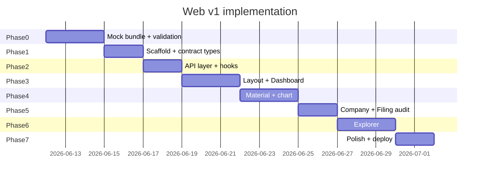

# Implementation Plan — Web Interface

| Field | Value |
|-------|-------|
| **Status** | Ready for execution |
| **Version** | 1.0 |
| **Prerequisite** | [hld-web-interface.md](./hld-web-interface.md) (contract v1.0) |
| **Owner** | Web / frontend |
| **Out of scope** | Agent pipeline, LLM extraction, live price feeds (v1) |

---

## 1. Objective

Deliver a **demo-ready web application** that:

1. Reads forecast data via the v1 JSON contract (mock first, API later)
2. Implements all v1 routes from the HLD
3. Ships with a validated `mock/v1/` bundle for offline demo
4. Requires **zero UI changes** when the agent team swaps mock → pipeline snapshots

---

## 2. Tech stack (decisions)

| Layer | Choice | Rationale |
|-------|--------|-----------|
| Framework | **React 18 + TypeScript** | Team familiarity, ecosystem for charts |
| Build | **Vite** | Fast dev, static deploy to Vercel/Netlify |
| Routing | **React Router v6** | SPA routes per HLD §4.2 |
| Data fetching | **TanStack Query v5** | Cache, loading/error states, stale-while-revalidate |
| Styling | **Tailwind CSS** | Speed for demo polish |
| Charts | **Recharts** | Composable React charts; signal + markers |
| Validation | **Zod** | Runtime parse of API responses; types inferred |
| Mock serving | **Vite `public/mock/v1/`** | Static files; copy from `mock/v1/` at build |
| Lint / format | ESLint + Prettier | Standard |
| Test | **Vitest** + React Testing Library | Unit + component tests |
| E2E | **Playwright** (`frontend/e2e/`) | Route smoke + mock API |
| Browser MCP | **@playwright/mcp** (`.cursor/mcp.json`) | Interactive UI checks in Cursor |

**Not in v1:** Next.js SSR, auth, state management library (Query + URL params sufficient).

---

## 3. Repository layout

```
algo-trade/
  docs/
    hld-web-interface.md          # existing
    implementation-plan-web.md    # this file
  backend/
    universe/                     # reference data (manufacturers, materials, instruments)
    mock/v1/                      # canonical mock bundle (source)
    scripts/
      validate-mock-contract.py   # CI validation
  frontend/                       # React app (Phase 1+)
    package.json
    vite.config.ts
    tsconfig.json
    index.html
    public/
      mock/                       # symlink or copy of ../mock/v1 at dev time
    src/
      main.tsx
      App.tsx
      routes/
        DashboardPage.tsx
        MaterialPage.tsx
        CompanyPage.tsx
        FilingPage.tsx
        ExplorerPage.tsx
        AboutPage.tsx
      components/
        layout/
        forecast/
        audit/
        explorer/
        shared/
      api/
        client.ts                 # base URL, fetch wrapper
        endpoints.ts              # typed GET helpers
        mockFilter.ts             # client-side extraction filters
      types/
        contract.ts               # Zod schemas + inferred types
      hooks/
        useForecastSummary.ts
        useRanking.ts
        useMaterialForecast.ts
        useExtractions.ts
        useManufacturers.ts
        useMaterials.ts
        useInstruments.ts
      lib/
        format.ts                 # dates, numbers
        explorerParams.ts         # URL ↔ Explorer state
    tests/
```

**Convention:** `frontend/` is an isolated npm package. Mock JSON is authored under `backend/mock/v1/` and copied to `frontend/public/mock/v1/` at dev time.

---

## 4. Implementation phases



---

## 5. Phase 0 — Mock bundle and validation

**Goal:** Data layer exists and passes CI before any React code.

### Tasks

| ID | Task | Output |
|----|------|--------|
| 0.1 | Create `mock/v1/` directory per HLD §7.2 | All JSON files | **done** |
| 0.2 | Author `manifest.json` with `contract_version: "1.0"` | manifest | **done** |
| 0.3 | Write `forecast/summary.json`, `ranking.json` | 5 materials ranked | **done** |
| 0.4 | Write `forecast/materials/{lithium,copper,electricity}.json` | Curves + BUY/SELL | **done** |
| 0.5 | Write `extractions/index.json` — 12 rows | Explorer test cases | **done** |
| 0.6 | Write `universe/manufacturers.json` — 8-company subset | Autocomplete | **done** |
| 0.7 | Write `universe/instruments/{lithium,copper,electricity}.json` | Instrument panels | **done** |
| 0.8 | Copy `universe/materials.json` into mock or reference repo path | 26 materials | **done** |
| 0.9 | Implement `scripts/validate-mock-contract.py` | Exit 0 on valid bundle | **done** |
| 0.10 | Add Explorer filter assertions to validation script | HLD §7.4 table | **done** |

### Definition of done

- [x] `python backend/scripts/validate-mock-contract.py` passes
- [x] All three Explorer test queries return expected counts
- [x] Every `dated_effects[].sector` resolves to `universe/materials.json`

---

## 6. Phase 1 — Project scaffold

**Goal:** Empty app boots, routes resolve, disclaimer visible.

### Tasks

| ID | Task | Output |
|----|------|--------|
| 1.1 | `npm create vite@latest frontend -- --template react-ts` | Base project | **done** |
| 1.2 | Add Tailwind, React Router, TanStack Query, Zod, Recharts | `package.json` | **done** |
| 1.3 | Configure `VITE_API_BASE` env (`/mock/v1` default) | `.env.example` | **done** |
| 1.4 | Copy or symlink `backend/mock/v1` → `frontend/public/mock/v1` | Static assets | **done** |
| 1.5 | Define Zod schemas in `src/types/contract.ts` from HLD §8 | All v1 types | **done** |
| 1.6 | Stub routes in `App.tsx` with placeholder pages | 6 routes | **done** |
| 1.7 | Build `AppShell`, `NavBar`, `DisclaimerBanner` | Layout | **done** |
| 1.8 | `AboutPage` with project disclaimer + link to repo README | Static page | **done** |

### Definition of done

- [x] `npm run dev` serves app at localhost
- [x] All routes navigable
- [x] Disclaimer on every page
- [x] `npm run build` succeeds

---

## 7. Phase 2 — API client and hooks

**Goal:** Typed data access against mock JSON; no UI beyond smoke test.

### Tasks

| ID | Task | Output |
|----|------|--------|
| 2.1 | `api/client.ts` — `get<T>(path)`, Zod parse on response | Safe fetch | **done** |
| 2.2 | `api/endpoints.ts` — one function per HLD §6 endpoint | Typed getters | **done** |
| 2.3 | `api/mockFilter.ts` — filter `extractions/index.json` by ticker, material, from, to | Explorer support | **done** |
| 2.4 | Mock mode: map API paths to static files (see table below) | Path resolver | **done** |
| 2.5 | Implement hooks wrapping TanStack Query | 7 hooks per HLD | **done** |
| 2.6 | Unit tests: Zod schemas accept mock files | `tests/contract.test.ts` | **done** |
| 2.7 | Unit tests: `mockFilter` Explorer cases | `tests/mockFilter.test.ts` | **done** |

### Mock path resolver

| `endpoints.getExtractions(params)` | Behavior |
|-----------------------------------|----------|
| Mock mode | Load `extractions/index.json`, filter in `mockFilter.ts`, return `ExtractionList` |
| API mode | `GET /api/v1/extractions?...` |

| Hook | Query key | Endpoint |
|------|-----------|----------|
| `useForecastSummary` | `['forecast','summary']` | `/forecast/summary` |
| `useRanking` | `['forecast','ranking']` | `/forecast/ranking` |
| `useMaterialForecast(id)` | `['forecast','materials',id]` | `/forecast/materials/{id}` |
| `useExtractions(filters)` | `['extractions',filters]` | filtered extractions |
| `useExtraction(id)` | `['extractions',id]` | `/extractions/{id}` or find in index |
| `useManufacturers(q?)` | `['universe','manufacturers',q]` | `/universe/manufacturers` |
| `useMaterials` | `['universe','materials']` | `/universe/materials` |
| `useInstruments(id)` | `['universe','instruments',id]` | `/universe/instruments/{id}` |

### Definition of done

- [ ] All hooks return parsed data from mock bundle in dev
- [ ] Invalid JSON fails Zod with clear error in console
- [ ] Contract tests pass in CI

---

## 8. Phase 3 — Dashboard

**Goal:** `/` is a credible demo landing page.

### Components to build

| Component | Data |
|-----------|------|
| `AsOfBanner` | `useForecastSummary` |
| `MaterialRankingTable` | `useRanking` |
| `TimingSummaryCards` | `useForecastSummary` → `top_materials` |
| `MaterialSparklineGrid` | `useMaterialForecast` per top material (parallel queries) |

### Tasks

| ID | Task |
|----|------|
| 3.1 | `DashboardPage` layout — banner, cards, table |
| 3.2 | Row click → `/materials/:materialId` |
| 3.3 | Ticker chip in table → `/companies/:ticker` |
| 3.4 | Loading skeletons + `EmptyState` ("Pipeline not run") |
| 3.5 | `ErrorState` with retry |

### Definition of done

- [x] Dashboard loads from mock in &lt; 2s
- [x] Top materials show rank, score, BUY/SELL, sparkline
- [x] Navigation to material and company works

---

## 9. Phase 4 — Material detail

**Goal:** `/materials/:materialId` is the core forecast view.

### Components to build

| Component | Data |
|-----------|------|
| `MaterialHeader` | materials vocabulary + ranking entry |
| `ForecastChart` | `useMaterialForecast` → `curve`, `actions` |
| `BuySellMarkers` | Recharts `ReferenceDot` or custom layer |
| `RankPanel` | `useRanking` for this material |
| `ContributorsTable` | `useExtractions({ material })` |
| `InstrumentsPanel` | `useInstruments(materialId)` |
| `SignalDataTable` | Toggle: chart data as accessible table (NFR-5) |

### Tasks

| ID | Task |
|----|------|
| 4.1 | Line chart: `signal` + optional `forward_AUC` toggle |
| 4.2 | BUY green / SELL red markers with tooltip rationale |
| 4.3 | Contributors table with links to company + filing |
| 4.4 | Instruments panel — six buckets, empty state per bucket |
| 4.5 | "Narrative signal, not price" callout above chart |
| 4.6 | Handle unknown `materialId` → 404 page |

### Definition of done

- [x] Lithium mock renders full chart with ≥1 BUY and ≥1 SELL marker
- [x] Contributors link to `/companies/TSLA` and `/filings/ext_*`
- [x] Chart data viewable as table

---

## 10. Phase 5 — Company and filing audit

**Goal:** Complete drill-down path for demo trust.

### Pages

| Page | Data |
|------|------|
| `CompanyPage` | `useManufacturers` + `useExtractions({ ticker })` |
| `FilingPage` | `useExtraction(id)` |

### Components

| Component | Purpose |
|-----------|---------|
| `CompanyHeader` | Name, GICS sector, CIK |
| `FilingList` | Filings with date, type, effect count |
| `ExtractionCard` | Summary on filing page |
| `DatedEffectsTable` | All effects with direction, magnitude, window |
| `SourceSpanHighlight` | Visual emphasis on `source_span` |
| `SecFilingLink` | External link to `filing_url` |

### Definition of done

- [x] Material → Company → Filing navigation works end-to-end
- [x] SEC link opens in new tab
- [x] `extractor_confidence` and `flagged_risks` visible

---

## 11. Phase 6 — Explorer

**Goal:** `/explorer` supports ticker + date range → extractions.

### URL state

```
/explorer?tickers=TSLA,GM&from=2026-01-01&to=2026-06-30&material=lithium
```

Sync all inputs ↔ URL (`explorerParams.ts`) for shareable demo links.

### Components

| Component | Purpose |
|-----------|---------|
| `TickerMultiSelect` | Search `useManufacturers` |
| `DateRangePicker` | Presets: Last quarter, YTD, Custom |
| `MaterialFilter` | Optional dropdown from `useMaterials` |
| `ShowResultsButton` | Validates ≥1 ticker, valid range |
| `ExplorerResultsTabs` | v1: Extractions tab only; Signal/Prices disabled with "Coming soon" |
| `ExtractionResultsList` | `useExtractions(filters)` |

### Tasks

| ID | Task |
|----|------|
| 6.1 | URL param parse + serialize |
| 6.2 | Ticker autocomplete (filter client-side on mock subset) |
| 6.3 | Date range validation (`from <= to`) |
| 6.4 | Results table with expandable `dated_effects` |
| 6.5 | Empty state for no matches |
| 6.6 | Row actions → company / filing / material pages |

### Definition of done

- [x] All HLD §7.4 Explorer test cases pass in UI
- [x] Shareable URL restores query on reload
- [x] Phase 2/3 tabs visible but disabled

---

## 12. Phase 7 — Polish and deploy

### Tasks

| ID | Task |
|----|------|
| 7.1 | Responsive pass (desktop-first, tablet usable) |
| 7.2 | 404 / error boundaries |
| 7.3 | `frontend/README.md` — install, dev, build, env vars |
| 7.4 | Root README — link to web app + docs |
| 7.5 | Deploy to Vercel or Netlify (`frontend/` as root) | **deferred** |
| 7.6 | Smoke test deployed URL against mock | **deferred** |
| 7.7 | Optional: GitHub Action — validate mock + `npm test` + `npm run build` | **done** |

### Definition of done (v1 release)

- [x] Local demo loads dashboard from mock
- [x] CI green on PR (web-ci workflow)
- [x] Agent team has contract doc + sample mock for pipeline export alignment

---

## 13. Testing strategy

| Level | What | When |
|-------|------|------|
| **Contract** | Zod parse all mock files | Phase 0, CI |
| **Unit** | `mockFilter`, `explorerParams`, formatters | Phase 2+ |
| **Component** | `ForecastChart` renders curve; `TickerMultiSelect` filters | Phase 4+ |
| **Manual** | Demo script below | Phase 7 |

### Manual demo script

1. Open `/` — verify top 3 materials and BUY/SELL cards
2. Click **Lithium** — chart, markers, contributors
3. Click **TSLA** in contributors — company filings list
4. Open a filing — source span, SEC link
5. Open **Explorer** — TSLA + GM, Jan–Jun 2026 — results appear
6. Copy URL, open in new tab — state restored
7. Open **About** — disclaimer visible

---

## 14. Dependencies on agent team

| Need | Blocking? | Workaround |
|------|-----------|------------|
| Contract sign-off on HLD §8 | Soft | Proceed with mock; adjust if they change schema |
| Pipeline snapshot export | No for v1 | Mock bundle |
| `GET /api/v1/*` server | No for v1 | Static mock; flip `VITE_API_BASE` later |
| `filing_url` in extractions | No for v1 | Placeholder SEC URLs in mock |
| Subset re-aggregation (Phase 2) | Yes for Explorer Signal tab | Tab disabled in v1 |

**Sync checkpoint:** Share `mock/v1/extractions/index.json` shape before they finalize buffer schema.

---

## 15. Risks and mitigations

| Risk | Impact | Mitigation |
|------|--------|------------|
| Contract changes mid-build | Rework types + mock | Version field; Zod failures catch drift |
| Recharts marker complexity | Schedule slip | Fallback: table-only actions in v1 |
| Large `extractions/index.json` in prod | Slow client filter | Move filter to API in v1.5 |
| Demo without pipeline | Weak credibility | Realistic mock narratives + SEC links |

---

## 16. Effort estimate

| Phase | Effort (1 dev) |
|-------|----------------|
| 0 Mock + validation | 2–3 days |
| 1 Scaffold | 1–2 days |
| 2 API + hooks | 2 days |
| 3 Dashboard | 2–3 days |
| 4 Material + chart | 3 days |
| 5 Company + filing | 2 days |
| 6 Explorer | 2–3 days |
| 7 Polish + deploy | 2 days |
| **Total v1** | **~16–20 days** |

Parallel work: wireframes during Phase 0; agent team aligns buffer export during Phase 2–4.

---

## 17. Post-v1 backlog

| Item | Phase | Notes |
|------|-------|-------|
| Explorer Signal tab (subset curves) | v1.5 | Needs `universe_curve` API |
| Explorer Prices tab | v3 | `/prices` endpoint |
| Pipeline API integration | v1.5 | `VITE_API_BASE=/api/v1` |
| Job trigger UI | v2 | POST /jobs |
| Backtest panel | v3 | Roadmap item |
| Compare materials on one chart | v1.5 | Dashboard enhancement |
| Filing event vertical ticks on chart | v1.5 | Needs filing dates on curve endpoint |

---

## 18. Document map

| Document | Role |
|----------|------|
| [README.md](../README.md) | Project overview, pipeline design |
| [backend/universe/README.md](../backend/universe/README.md) | Reference data vocabulary |
| [hld-web-interface.md](./hld-web-interface.md) | Architecture + JSON contract |
| **implementation-plan-web.md** | This file — how to build it |
| `frontend/README.md` | Run instructions (created in Phase 1) |

---

## Appendix A — Environment variables

| Variable | Default | Description |
|----------|---------|-------------|
| `VITE_API_BASE` | `/mock/v1` | Base path for data fetch |
| `VITE_DATA_SOURCE` | `mock` | `mock` \| `api` — controls extraction filter behavior |

---

## Appendix B — CI sketch (GitHub Actions)

```yaml
# .github/workflows/web.yml (future)
jobs:
  web:
    steps:
      - run: python backend/scripts/validate-mock-contract.py
      - run: cd frontend && npm ci && npm test && npm run build
```

---

## Appendix C — Implementation checklist (copy for tracking)

```
Phase 0  [x] mock bundle  [x] validate script  [ ] CI
Phase 1  [x] vite scaffold  [x] routes  [x] layout  [x] about
Phase 2  [x] zod types  [x] api client  [x] hooks  [x] tests
Phase 2b [x] Playwright E2E + MCP config (see docs/playwright-mcp.md)
Phase 3  [x] dashboard  [x] ranking table  [x] sparklines
Phase 4  [x] material page  [x] forecast chart  [x] BUY/SELL  [x] instruments
Phase 5  [x] company page  [x] filing page  [x] SEC links
Phase 6  [x] explorer  [x] URL state  [x] extraction results
Phase 7  [x] polish  [ ] deploy (deferred)  [x] demo script passed
```
